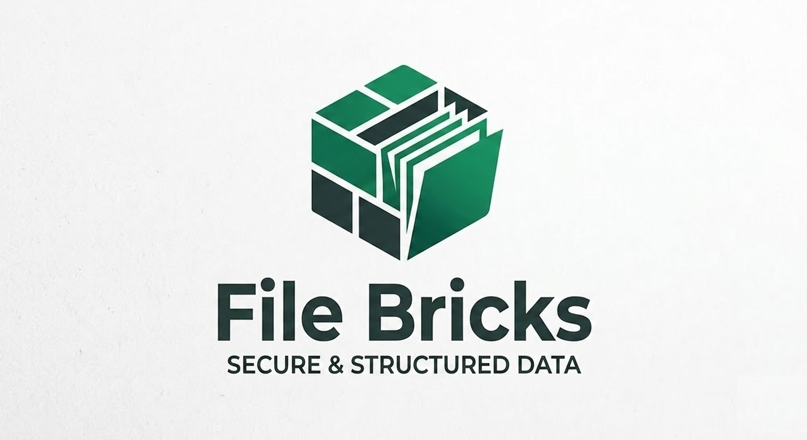

# file-bricks
<!-- last-checked: 2026-06-11 -->

**Local-first desktop software for files, documents, prompts, feeds, cloud-sync repair, and personal knowledge work.**

file-bricks builds open, inspectable Windows and cross-platform tools for people who want their working data to stay on their own machine first. Most projects are Python/PySide6 desktop apps; browser extensions cover private RSS workflows. The shared focus is local data ownership, fast search, practical automation, privacy checks, and optional AI only where it improves the task.

Search terms this organization is built around: local-first desktop apps, PySide6 file manager, OCR document search, local RAG, prompt manager, RSS bookmarks, SQLite viewer, OneDrive lock repair, privacy tools, and Microsoft Store packaging.

## Start Here

| Need | Start with | Why |
|---|---|---|
| Explore, preview, and organize local files | [ExplorerPro](https://github.com/file-bricks/ExplorerPro) | Advanced file browser with preview panels, privacy monitoring, and sync-aware workflows |
| Search and manage document-heavy folders | [ProFiler](https://github.com/file-bricks/ProFiler) | File management suite with full-text search, OCR, and document workflows |
| Keep folders and backups synchronized | [ProSync](https://github.com/file-bricks/ProSync) | Scheduled sync with database safety and backup-oriented workflows |
| Repair files blocked by cloud-sync locks | [CloudLockFixer](https://github.com/file-bricks/CloudLockFixer) | Tray and CLI tool for copy-delete retries in OneDrive-style locked folders |
| Analyze private documents with local AI workflows | [NoteSpaceLLM](https://github.com/file-bricks/NoteSpaceLLM) | Local NotebookLM-style document chat, RAG, and report exports |
| Build reusable LLM building blocks | [promptboard](https://github.com/file-bricks/promptboard) | Tray app for PROMPT, SKILL, WORKFLOW, ROLLE, and AGENT blocks |
| Maintain a personal prompt library | [ProfiPrompt](https://github.com/file-bricks/ProfiPrompt) | Desktop prompt manager for organizing, versioning, and exporting prompt assets |
| Read RSS without a cloud account | [RSS-BOOK](https://github.com/file-bricks/RSS-BOOK) | Privacy-first RSS and Atom reader that stores feeds as browser bookmarks |

## Project Families

### File, Sync And Data Tools

| App | Description |
|---|---|
| [ExplorerPro](https://github.com/file-bricks/ExplorerPro) | Advanced local file explorer with preview, privacy, and sync-oriented workflows |
| [ProFiler](https://github.com/file-bricks/ProFiler) | Professional file management suite for OCR, search, and document-heavy folders |
| [ProSync](https://github.com/file-bricks/ProSync) | Backup synchronization with scheduling and database safety checks |
| [CloudLockFixer](https://github.com/file-bricks/CloudLockFixer) | Windows tray and CLI utility for renaming, moving, and deleting cloud-locked files |
| [SQLiteViewer](https://github.com/file-bricks/SQLiteViewer) | Lightweight SQLite browser with schema view, SQL editor, full-text search, CSV export, and JSON export |

### Knowledge, Documents And AI Workflows

| App | Description |
|---|---|
| [NoteSpaceLLM](https://github.com/file-bricks/NoteSpaceLLM) | Local, privacy-first alternative to notebook-style document analysis tools |
| [knowledgedigest](https://github.com/file-bricks/knowledgedigest) | Portable knowledge database with local indexing, search, and optional LLM summaries |
| [promptboard](https://github.com/file-bricks/promptboard) | Lightweight tray app for reusable LLM building blocks with Markdown materialization |
| [ProfiPrompt](https://github.com/file-bricks/ProfiPrompt) | Desktop prompt manager for reusable PROMPT, SKILL, WORKFLOW, ROLLE, and AGENT blocks |
| [MetaWiki](https://github.com/file-bricks/MetaWiki) | Modular bilingual knowledge scaffold with 630+ compact stubs for AI-assisted knowledge work |

### Feeds, Utilities And Packaging

| App | Description |
|---|---|
| [RSS-BOOK](https://github.com/file-bricks/RSS-BOOK) | Privacy-first RSS/Atom browser extension that saves feed entries as bookmarks |
| [RSS-BOOKSTORE](https://github.com/file-bricks/RSS-BOOKSTORE) | Power-user RSS extension with Native Messaging host and bidirectional Windows folder sync |
| [AmpelClip](https://github.com/file-bricks/AmpelClip) | Clipboard privacy monitor for IBAN, email, phone, card, and other sensitive text patterns |
| [SoftwareCenter](https://github.com/file-bricks/SoftwareCenter) | Lightweight desktop organizer for software shortcuts and launch surfaces |
| [WinStorePackager](https://github.com/file-bricks/WinStorePackager) | GUI tool for preparing Python desktop apps for Microsoft Store packaging |

## Repository Coverage

The public product index above covers the active file-bricks repositories:

| Area | Repositories |
|---|---|
| File, sync, and data | [ExplorerPro](https://github.com/file-bricks/ExplorerPro), [ProFiler](https://github.com/file-bricks/ProFiler), [ProSync](https://github.com/file-bricks/ProSync), [CloudLockFixer](https://github.com/file-bricks/CloudLockFixer), [SQLiteViewer](https://github.com/file-bricks/SQLiteViewer) |
| Knowledge and AI | [NoteSpaceLLM](https://github.com/file-bricks/NoteSpaceLLM), [knowledgedigest](https://github.com/file-bricks/knowledgedigest), [promptboard](https://github.com/file-bricks/promptboard), [ProfiPrompt](https://github.com/file-bricks/ProfiPrompt), [MetaWiki](https://github.com/file-bricks/MetaWiki) |
| Feeds and utilities | [RSS-BOOK](https://github.com/file-bricks/RSS-BOOK), [RSS-BOOKSTORE](https://github.com/file-bricks/RSS-BOOKSTORE), [AmpelClip](https://github.com/file-bricks/AmpelClip), [SoftwareCenter](https://github.com/file-bricks/SoftwareCenter), [WinStorePackager](https://github.com/file-bricks/WinStorePackager) |
| Organization infrastructure | [`.github`](https://github.com/file-bricks/.github) profile README, default community files, workflow templates, and [`llms.txt`](https://github.com/file-bricks/.github/blob/main/llms.txt) |

## Design Principles

- **Local-first:** primary data stays on the user's machine.
- **Privacy-conscious:** tools avoid cloud dependencies unless a user explicitly chooses an external workflow.
- **Desktop-practical:** projects are built for repeated real workflows, not only demos.
- **Open and inspectable:** repositories include source, tests where available, and project notes for maintainers and LLM assistants.

## Ecosystem

file-bricks is the file and knowledge-work branch of the broader brick ecosystem:

[open-bricks](https://github.com/open-bricks) | [doc-bricks](https://github.com/doc-bricks) | [dev-bricks](https://github.com/dev-bricks) | [ellmos-ai](https://github.com/ellmos-ai)

For machine-readable navigation, see [`llms.txt`](https://github.com/file-bricks/.github/blob/main/llms.txt).
