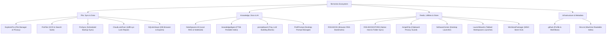

# file-bricks
<!-- last-checked: 2026-09-13 -->

[English (EN)](README.md) | [Deutsch (DE)](README_de.md)

**Local-first desktop software for files, documents, prompts, feeds, cloud-sync repair, and personal knowledge work.**

> [!NOTE]
> **file-bricks** builds open, inspectable Windows and cross-platform desktop applications for people who want their working data to stay on their own machine. The organization currently maintains **16 active public repositories** (15 product tools + 1 profile repository). The shared focus is local data ownership, fast search, practical automation, clipboard privacy, cloud-lock repair, and optional AI workflows.

Search terms this organization is built around: local-first desktop apps, PySide6 file manager, OCR document search, local RAG, prompt manager, RSS bookmarks, SQLite viewer, OneDrive lock repair, privacy tools, clipboard monitor, workspace launcher, tabbed shortcut manager, and Microsoft Store packaging.

---

## Tools

All 15 product tools at a glance — the banners are the links; details in the tables below:

[LaunchBoards](https://github.com/file-bricks/LaunchBoards) is the sister workspace-framing of [SoftwareCenter](https://github.com/file-bricks/SoftwareCenter), organizing desktop shortcuts into switchable launch boards and sharing its underlying desktop engine.

---

## Current Public Activity

The latest public repository activity across `file-bricks` reflects active maintenance and ecosystem refinement. This is a freshness snapshot; the complete 16-repository directory remains below.

| Repository | Latest public activity |
|---|---|
| [WinStorePackager](https://github.com/file-bricks/WinStorePackager) | 2026-09-13 |
| [SoftwareCenter](https://github.com/file-bricks/SoftwareCenter) | 2026-09-13 |
| [ProSync](https://github.com/file-bricks/ProSync) | 2026-09-12 |
| [CloudLockFixer](https://github.com/file-bricks/CloudLockFixer) | 2026-09-12 |
| [ProFiler](https://github.com/file-bricks/ProFiler) | 2026-09-12 |
| [ExplorerPro](https://github.com/file-bricks/ExplorerPro) | 2026-09-12 |
| [ProfiPrompt](https://github.com/file-bricks/ProfiPrompt) | 2026-09-12 |
| [KnowledgeDigest](https://github.com/file-bricks/knowledgedigest) | 2026-09-10 |
| [LaunchBoards](https://github.com/file-bricks/LaunchBoards) | 2026-09-10 |
| [promptboard](https://github.com/file-bricks/promptboard) | 2026-09-10 |
| [.github](https://github.com/file-bricks/.github) | 2026-09-13 |
| [RSS-BOOK](https://github.com/file-bricks/RSS-BOOK) | 2026-09-02 |

---

## Architecture & Ecosystem Map

```mermaid
graph TD
    FB["file-bricks Ecosystem"] --> FILE["File, Sync & Data"]
    FB --> KNOW["Knowledge, Docs & AI"]
    FB --> UTIL["Feeds, Utilities & Store"]
    FB --> INFRA["Infrastructure & Metadata"]

    FILE --> EP["ExplorerPro (File Manager & Privacy)"]
    FILE --> PF["ProFiler (OCR & Search Suite)"]
    FILE --> PS["ProSync (Scheduled Backup Sync)"]
    FILE --> CLF["CloudLockFixer (cldflt.sys Lock Repair)"]
    FILE --> SQV["SQLiteViewer (DB Browser & Exports)"]

    KNOW --> NSL["NoteSpaceLLM (Local RAG & Notebook)"]
    KNOW --> KD["knowledgedigest (FTS5 Portable Index)"]
    KNOW --> PB["promptboard (Tray LLM Building Blocks)"]
    KNOW --> PP["ProfiPrompt (Desktop Prompt Manager)"]

    UTIL --> RB["RSS-BOOK (Browser RSS Bookmarks)"]
    UTIL --> RBS["RSS-BOOKSTORE (Native Host & Folder Sync)"]
    UTIL --> AC["AmpelClip (Clipboard Privacy Guard)"]
    UTIL --> SC["SoftwareCenter (Desktop Launcher)"]
    UTIL --> LB["LaunchBoards (Tabbed Workspaces Launcher)"]
    UTIL --> WSP["WinStorePackager (MSIX Store GUI)"]

    INFRA --> GH[".github (Profile & Workflows)"]
    INFRA --> LLM["llms.txt (Machine-Readable Index)"]
```

---

## Start Here

| Need | Start with | Why |
|---|---|---|
| Explore, preview, and organize local files | [ExplorerPro](https://github.com/file-bricks/ExplorerPro) | Advanced file browser with preview panels, privacy monitoring, and sync-aware workflows |
| Search and manage document-heavy folders | [ProFiler](https://github.com/file-bricks/ProFiler) | File management suite with full-text search, OCR, and document workflows |
| Index and digest document knowledge bases | [knowledgedigest](https://github.com/file-bricks/knowledgedigest) | Portable SQLite FTS5 document database with GUI and Web viewer |
| Keep folders and backups synchronized | [ProSync](https://github.com/file-bricks/ProSync) | Scheduled sync with database safety and backup-oriented workflows |
| Repair files blocked by cloud-sync locks | [CloudLockFixer](https://github.com/file-bricks/CloudLockFixer) | Windows tray and CLI tool for copy-delete retries in OneDrive-style locked folders |
| Monitor clipboard privacy & anonymize text | [AmpelClip](https://github.com/file-bricks/AmpelClip) | Clipboard guard with traffic-light workflow and offline PWA companion |
| Analyze private documents with local AI workflows | [NoteSpaceLLM](https://github.com/file-bricks/NoteSpaceLLM) | Local NotebookLM-style document chat, RAG, and report exports |
| Build reusable LLM building blocks | [promptboard](https://github.com/file-bricks/promptboard) | Windows tray app for PROMPT, SKILL, WORKFLOW, ROLLE, and AGENT blocks |
| Maintain a personal prompt library | [ProfiPrompt](https://github.com/file-bricks/ProfiPrompt) | Desktop prompt manager for organizing, versioning, and exporting prompt assets |
| Read RSS without a cloud account | [RSS-BOOK](https://github.com/file-bricks/RSS-BOOK) | Privacy-first RSS and Atom reader that stores feeds as browser bookmarks |
| Organize shortcuts into tabbed launch boards | [LaunchBoards](https://github.com/file-bricks/LaunchBoards) | Lightweight workspace launcher focusing on customizable boards and fast app switching |
| Organize installed desktop software | [SoftwareCenter](https://github.com/file-bricks/SoftwareCenter) | Categorized desktop application organizer with tray integration |
| Package Python apps for Microsoft Store | [WinStorePackager](https://github.com/file-bricks/WinStorePackager) | GUI tool for MSIX manifest creation, icon scaling, and store submission profiles |

---

## Project Families

### File, Sync And Data Tools

| App | Description |
|---|---|
| [ExplorerPro](https://github.com/file-bricks/ExplorerPro) | Advanced local file explorer with preview, privacy, and sync-oriented workflows |
| [ProFiler](https://github.com/file-bricks/ProFiler) | Professional file management suite for OCR, search, and document-heavy folders |
| [ProSync](https://github.com/file-bricks/ProSync) | Backup synchronization with scheduling and database safety checks |
| [CloudLockFixer](https://github.com/file-bricks/CloudLockFixer) | Windows tray and CLI utility for renaming, moving, and deleting cloud-locked files |
| [SQLiteViewer](https://github.com/file-bricks/SQLiteViewer) | Lightweight SQLite browser with schema view, SQL editor, full-text search, CSV export, and JSON export |

### Knowledge, Documents And AI Workflows

| App | Description |
|---|---|
| [NoteSpaceLLM](https://github.com/file-bricks/NoteSpaceLLM) | Local, privacy-first alternative to notebook-style document analysis tools |
| [knowledgedigest](https://github.com/file-bricks/knowledgedigest) | Portable knowledge database with local indexing, search, and optional LLM summaries |
| [promptboard](https://github.com/file-bricks/promptboard) | Lightweight tray app for reusable LLM building blocks with Markdown materialization |
| [ProfiPrompt](https://github.com/file-bricks/ProfiPrompt) | Desktop prompt manager for reusable PROMPT, SKILL, WORKFLOW, ROLLE, and AGENT blocks |

### Feeds, Utilities And Packaging

| App | Description |
|---|---|
| [RSS-BOOK](https://github.com/file-bricks/RSS-BOOK) | Privacy-first RSS/Atom browser extension that saves feed entries as bookmarks |
| [RSS-BOOKSTORE](https://github.com/file-bricks/RSS-BOOKSTORE) | Power-user RSS extension with Native Messaging host and bidirectional Windows folder sync |
| [AmpelClip](https://github.com/file-bricks/AmpelClip) | Clipboard privacy monitor for IBAN, email, phone, card, and sensitive text patterns |
| [SoftwareCenter](https://github.com/file-bricks/SoftwareCenter) | Lightweight desktop organizer for software shortcuts and launch surfaces |
| [LaunchBoards](https://github.com/file-bricks/LaunchBoards) | Tabbed workspace app organizer and sister product to SoftwareCenter with dedicated boards framing |
| [WinStorePackager](https://github.com/file-bricks/WinStorePackager) | GUI tool for preparing Python desktop apps for Microsoft Store packaging |

---

## Repository Coverage

The public product index above covers all **16 active public file-bricks repositories**:

| Area | Repositories |
|---|---|
| File, sync, and data | [ExplorerPro](https://github.com/file-bricks/ExplorerPro), [ProFiler](https://github.com/file-bricks/ProFiler), [ProSync](https://github.com/file-bricks/ProSync), [CloudLockFixer](https://github.com/file-bricks/CloudLockFixer), [SQLiteViewer](https://github.com/file-bricks/SQLiteViewer) |
| Knowledge and AI | [NoteSpaceLLM](https://github.com/file-bricks/NoteSpaceLLM), [knowledgedigest](https://github.com/file-bricks/knowledgedigest), [promptboard](https://github.com/file-bricks/promptboard), [ProfiPrompt](https://github.com/file-bricks/ProfiPrompt) |
| Feeds and utilities | [RSS-BOOK](https://github.com/file-bricks/RSS-BOOK), [RSS-BOOKSTORE](https://github.com/file-bricks/RSS-BOOKSTORE), [AmpelClip](https://github.com/file-bricks/AmpelClip), [SoftwareCenter](https://github.com/file-bricks/SoftwareCenter), [LaunchBoards](https://github.com/file-bricks/LaunchBoards), [WinStorePackager](https://github.com/file-bricks/WinStorePackager) |
| Organization infrastructure | [`.github`](https://github.com/file-bricks/.github) profile README, default community files, workflow templates, and [`llms.txt`](https://github.com/file-bricks/.github/blob/main/llms.txt) |

> [!TIP]
> All repositories in `file-bricks` are designed with **inspectable file formats** (SQLite, JSON, Markdown) and support zero-dependency local execution. AI components operate strictly on opt-in local or user-configured endpoint models.

---

## Design Principles

- **Local-first:** primary data stays on the user's machine.
- **Privacy-conscious:** tools avoid cloud dependencies unless a user explicitly chooses an external workflow.
- **Desktop-practical:** projects are built for repeated real workflows, not only demos.
- **Open and inspectable:** repositories include source, tests where available, and project notes for maintainers and LLM assistants.

---

## Search And Discovery

Useful GitHub and web search phrases include:
- `file-bricks local-first desktop apps`
- `PySide6 local file manager with OCR and PDF tools`
- `ExplorerPro privacy file explorer Windows`
- `ProFiler desktop document search SQLite FTS5`
- `CloudLockFixer cldflt.sys OneDrive lock repair tool`
- `ProSync scheduled backup database safety Windows`
- `SQLiteViewer lightweight Python SQLite browser CSV JSON export`
- `NoteSpaceLLM local NotebookLM alternative private RAG`
- `knowledgedigest portable SQLite document database`
- `promptboard Windows tray LLM prompt blocks`
- `ProfiPrompt desktop prompt manager PWA companion`
- `WinStorePackager Python Microsoft Store MSIX GUI packager`
- `AmpelClip Windows clipboard privacy monitor anonymizer`
- `LaunchBoards tabbed workspace desktop shortcut launcher`
- `SoftwareCenter cross-platform desktop application launcher`
- `RSS-BOOK privacy-first Chrome bookmark RSS extension`

---

## Ecosystem

file-bricks is the file management, prompt tooling, and desktop applications branch of the broader research, software, and AI tool ecosystem:

| Organization | Purpose | Link |
|---|---|---|
| **open-bricks** | Umbrella organization for all tools and software products | [open-bricks](https://github.com/open-bricks) |
| **file-bricks** | File management, prompt libraries, and desktop applications | [file-bricks](https://github.com/file-bricks) |
| **doc-bricks** | Document management, OCR, and invoice processing tools | [doc-bricks](https://github.com/doc-bricks) |
| **dev-bricks** | Developer tools, bridges, IDEs, and CLI utilities | [dev-bricks](https://github.com/dev-bricks) |
| **ellmos-ai** | AI infrastructure, MCP servers, and agent frameworks | [ellmos-ai](https://github.com/ellmos-ai) |
| **research-line** | Open-Science, mathematical physics, and research repositories | [research-line](https://github.com/research-line) |
| **biotec-line** | Local-first bioinformatics, VCF, and genetic variant tools | [biotec-line](https://github.com/biotec-line) |
| **entertain-and-more** | Interactive chess, tabletop RPG, and podcast studio tools | [entertain-and-more](https://github.com/entertain-and-more) |
| **assistassets-ai** | Local-first personal assistants and financial tools | [assistassets-ai](https://github.com/assistassets-ai) |
| **um-bruch** | Public-interest prototypes, health-policy analysis, and civic-tech tools | [um-bruch](https://github.com/um-bruch) |
| **lukisch** | Personal developer profile | [lukisch](https://github.com/lukisch) |

---

For machine-readable navigation, see [`llms.txt`](https://github.com/file-bricks/.github/blob/main/llms.txt).
