# file-bricks
<!-- last-checked: 2026-08-06 -->

[English (EN)](README.md) | [Deutsch (DE)](README_de.md)

**Local-first Desktop-Software für Dateien, Dokumente, Prompts, RSS-Feeds, Cloud-Sync-Reparatur und persönliche Wissensarbeit.**

> [!NOTE]
> **file-bricks** entwickelt quelloffene, transparente Windows- und plattformübergreifende Desktop-Anwendungen für Anwender, deren Arbeitsdaten primär auf dem eigenen Rechner verbleiben sollen. Die Organisation betreut aktuell **15 aktive öffentliche Repositories** (14 Produktwerkzeuge + 1 Organisationsprofil-Repository). Der gemeinsame Fokus liegt auf lokaler Datensouveränität, schneller Suche, praktischer Automatisierung, Datenschutz in der Zwischenablage, Cloud-Sync-Reparatur und optionalen KI-Workflows.

Kernbegriffe der Organisation: Local-First Desktop-Apps, PySide6 Dateimanager, OCR Dokumenten-Suche, lokales RAG, Prompt-Manager, RSS-Lesezeichen, SQLite-Browser, OneDrive Datei-Sperren-Reparatur, Datenschutz-Tools, Zwischenablage-Monitor und Microsoft Store Verpackung.

---

## Werkzeuge

Alle 14 Produktwerkzeuge auf einen Blick — die Banner sind die Links; Details in den Tabellen darunter:

[SoftwareCenter](https://github.com/file-bricks/SoftwareCenter) ist in den Tabellen darunter aufgeführt; es hat noch kein eigenes Banner-Artwork.

---

## Aktuelle öffentliche Aktivität

Die jüngste öffentliche Repository-Aktivität konzentriert sich derzeit auf `ProFiler`, `NoteSpaceLLM`, `RSS-BOOK`, `ProSync` und `AmpelClip`. Dies ist nur ein Aktualitätssnapshot; das vollständige Verzeichnis mit 15 Repositories folgt darunter.

| Repository | Jüngste öffentliche Aktivität |
|---|---|
| [ProFiler](https://github.com/file-bricks/ProFiler) | 2026-08-05 |
| [NoteSpaceLLM](https://github.com/file-bricks/NoteSpaceLLM) | 2026-08-05 |
| [RSS-BOOK](https://github.com/file-bricks/RSS-BOOK) | 2026-08-05 |
| [ProSync](https://github.com/file-bricks/ProSync) | 2026-08-05 |
| [AmpelClip](https://github.com/file-bricks/AmpelClip) | 2026-08-05 |

---

## Architektur- & Ökosystem-Karte

```mermaid
graph TD
    FB["file-bricks Ökosystem"] --> FILE["Datei, Sync & Daten"]
    FB --> KNOW["Wissen, Dokumente & KI"]
    FB --> UTIL["Feeds, Utilities & Store"]
    FB --> INFRA["Infrastruktur & Metadaten"]

    FILE --> EP["ExplorerPro (Dateimanager & Datenschutz)"]
    FILE --> PF["ProFiler (OCR & Volltextsuche)"]
    FILE --> PS["ProSync (Terminierter Backup-Sync)"]
    FILE --> CLF["CloudLockFixer (cldflt.sys Sperren-Reparatur)"]
    FILE --> SQV["SQLiteViewer (DB-Browser & Exporte)"]

    KNOW --> NSL["NoteSpaceLLM (Lokales RAG & Notebook)"]
    KNOW --> KD["knowledgedigest (FTS5 Portable Index)"]
    KNOW --> PB["promptboard (Tray LLM-Bausteine)"]
    KNOW --> PP["ProfiPrompt (Desktop Prompt-Manager)"]

    UTIL --> RB["RSS-BOOK (Browser RSS-Lesezeichen)"]
    UTIL --> RBS["RSS-BOOKSTORE (Native Host & Ordner-Sync)"]
    UTIL --> AC["AmpelClip (Zwischenablage-Datenschutzwächter)"]
    UTIL --> SC["SoftwareCenter (Desktop-Launcher)"]
    UTIL --> WSP["WinStorePackager (MSIX Store GUI)"]

    INFRA --> GH[".github (Profil & Workflows)"]
    INFRA --> LLM["llms.txt (Maschinenlesbarer Index)"]
```

---

## Schnelleinstieg

| Anwendungsfall | Empfohlene App | Vorteil |
|---|---|---|
| Lokale Dateien erkunden, vorschauen & ordnen | [ExplorerPro](https://github.com/file-bricks/ExplorerPro) | Dateibrowser mit Vorschaufeldern, Datenschutz-Prüfung & Sync-Funktionen |
| Dokumentenreiche Ordner durchsuchen & verwalten | [ProFiler](https://github.com/file-bricks/ProFiler) | Dateimanagement-Suite mit Volltextsuche, OCR & Dokumenten-Workflows |
| Wissensdatenbanken indizieren & auswerten | [knowledgedigest](https://github.com/file-bricks/knowledgedigest) | Portable SQLite-FTS5 Dokumentendatenbank mit GUI & Web-Viewer |
| Ordner & Backups synchron halten | [ProSync](https://github.com/file-bricks/ProSync) | Terminierte Synchronisation mit Datenbank-Sicherheitsprüfungen |
| Durch Cloud-Sync gesperrte Dateien reparieren | [CloudLockFixer](https://github.com/file-bricks/CloudLockFixer) | Windows Tray- & CLI-Tool für Copy-Delete-Wiederholungen bei `cldflt.sys`-Sperren |
| Zwischenablage-Datenschutz überwachen & anonymisieren | [AmpelClip](https://github.com/file-bricks/AmpelClip) | Datenschutzwächter mit Ampel-Workflow & Offline-PWA-Companion |
| Private Dokumente mit lokaler KI analysieren | [NoteSpaceLLM](https://github.com/file-bricks/NoteSpaceLLM) | Lokale NotebookLM-Alternative für Dokumenten-Chat, RAG & Berichte |
| Wiederverwendbare LLM-Bausteine erstellen | [promptboard](https://github.com/file-bricks/promptboard) | Windows Tray-App für PROMPT-, SKILL-, WORKFLOW-, ROLLE- & AGENT-Bausteine |
| Persönliche Prompt-Bibliothek verwalten | [ProfiPrompt](https://github.com/file-bricks/ProfiPrompt) | Desktop Prompt-Manager zum Strukturieren, Versionieren & Exportieren von Prompts |
| RSS-Feeds ohne Cloud-Konto lesen | [RSS-BOOK](https://github.com/file-bricks/RSS-BOOK) | Datenschutzfreundliche RSS-/Atom-Erweiterung, die Feeds als Lesezeichen speichert |

---

## Projektfamilien

### Datei-, Sync- und Daten-Werkzeuge

| App | Beschreibung |
|---|---|
| [ExplorerPro](https://github.com/file-bricks/ExplorerPro) | Dateibrowser mit Vorschaufeldern, Datenschutz-Prüfung und Sync-Workflows |
| [ProFiler](https://github.com/file-bricks/ProFiler) | Professionelle Dateimanagement-Suite für OCR, Suche und Dokumentenordner |
| [ProSync](https://github.com/file-bricks/ProSync) | Backup-Synchronisation mit Zeitplanung und Datenbank-Sicherheitsprüfungen |
| [CloudLockFixer](https://github.com/file-bricks/CloudLockFixer) | Windows Tray- & CLI-Werkzeug zum Umbenennen, Verschieben und Löschen cloud-gesperrter Dateien |
| [SQLiteViewer](https://github.com/file-bricks/SQLiteViewer) | Leichtgewichtiger SQLite-Browser mit Schemaansicht, SQL-Editor, Volltextsuche, CSV- & JSON-Export |

### Wissen, Dokumente und KI-Workflows

| App | Beschreibung |
|---|---|
| [NoteSpaceLLM](https://github.com/file-bricks/NoteSpaceLLM) | Lokale, datenschutzfreundliche Alternative zu Notebook-Dokumenten-Analyse-Tools |
| [knowledgedigest](https://github.com/file-bricks/knowledgedigest) | Portable Wissensdatenbank mit lokaler Indizierung, Suche und optionalen LLM-Zusammenfassungen |
| [promptboard](https://github.com/file-bricks/promptboard) | Leichtgewichtige Tray-App für wiederverwendbare LLM-Bausteine mit Markdown-Materialisierung |
| [ProfiPrompt](https://github.com/file-bricks/ProfiPrompt) | Desktop Prompt-Manager für strukturierte PROMPT-, SKILL-, WORKFLOW-, ROLLE- und AGENT-Bausteine |

### Feeds, Dienstprogramme und Packaging

| App | Beschreibung |
|---|---|
| [RSS-BOOK](https://github.com/file-bricks/RSS-BOOK) | Datenschutzfreundliche Chrome-Erweiterung, die RSS-/Atom-Feeds direkt als Browser-Lesezeichen speichert |
| [RSS-BOOKSTORE](https://github.com/file-bricks/RSS-BOOKSTORE) | Power-User RSS-Erweiterung mit Native-Messaging-Host und bidirektionaler Windows-Ordnersynchronisation |
| [AmpelClip](https://github.com/file-bricks/AmpelClip) | Zwischenablage-Datenschutzwächter für IBAN, E-Mail, Telefonnummern, Kreditkarten und sensible Textmuster |
| [SoftwareCenter](https://github.com/file-bricks/SoftwareCenter) | Leichtgewichtiger Desktop-Organizer für Software-Verknüpfungen und Starter-Oberflächen |
| [WinStorePackager](https://github.com/file-bricks/WinStorePackager) | GUI-Tool zur Vorbereitung von Python Desktop-Apps für die Microsoft Store MSIX-Paketierung |

---

## Repository-Abdeckung

Die obige Produktübersicht deckt alle **15 aktiven öffentlichen file-bricks Repositories** ab:

| Bereich | Repositories |
|---|---|
| Datei, Sync & Daten | [ExplorerPro](https://github.com/file-bricks/ExplorerPro), [ProFiler](https://github.com/file-bricks/ProFiler), [ProSync](https://github.com/file-bricks/ProSync), [CloudLockFixer](https://github.com/file-bricks/CloudLockFixer), [SQLiteViewer](https://github.com/file-bricks/SQLiteViewer) |
| Wissen & KI | [NoteSpaceLLM](https://github.com/file-bricks/NoteSpaceLLM), [knowledgedigest](https://github.com/file-bricks/knowledgedigest), [promptboard](https://github.com/file-bricks/promptboard), [ProfiPrompt](https://github.com/file-bricks/ProfiPrompt) |
| Feeds & Dienstprogramme | [RSS-BOOK](https://github.com/file-bricks/RSS-BOOK), [RSS-BOOKSTORE](https://github.com/file-bricks/RSS-BOOKSTORE), [AmpelClip](https://github.com/file-bricks/AmpelClip), [SoftwareCenter](https://github.com/file-bricks/SoftwareCenter), [WinStorePackager](https://github.com/file-bricks/WinStorePackager) |
| Organisations-Infrastruktur | [`.github`](https://github.com/file-bricks/.github) Profil-README, Community-Standards, Workflow-Vorlagen und [`llms.txt`](https://github.com/file-bricks/.github/blob/main/llms.txt) |

> [!TIP]
> Alle Repositories in `file-bricks` basieren auf **transparenten Dateiformaten** (SQLite, JSON, Markdown) und erlauben einen abhängigkeitsarmen Betrieb ohne Cloud-Zwang. KI-Komponenten arbeiten ausschließlich mit Opt-in-lokalen oder benutzerdefinierten Modell-Endpunkten.

---

## Design-Prinzipien

- **Local-First:** Primäre Daten verbleiben auf dem Gerät des Nutzers.
- **Datenschutzbewusst:** Werkzeuge verzichten auf Cloud-Zwang, außer der Nutzer wählt explizit einen externen Dienst.
- **Praxisnah für den Desktop:** Entwickelt für wiederkehrende tägliche Arbeitsabläufe, nicht nur für Demos.
- **Open & Inspektionsoffen:** Repositories enthalten Quellcode, Tests und Dokumentation für Entwickler und KI-Assistenten.

---

## Ökosystem

file-bricks bildet den Zweig für Datei- und Wissensarbeit innerhalb des Bricks-Ökosystems:

[open-bricks](https://github.com/open-bricks) | [doc-bricks](https://github.com/doc-bricks) | [dev-bricks](https://github.com/dev-bricks) | [ellmos-ai](https://github.com/ellmos-ai)

Für maschinenlesbare Navigation siehe [`llms.txt`](https://github.com/file-bricks/.github/blob/main/llms.txt).
